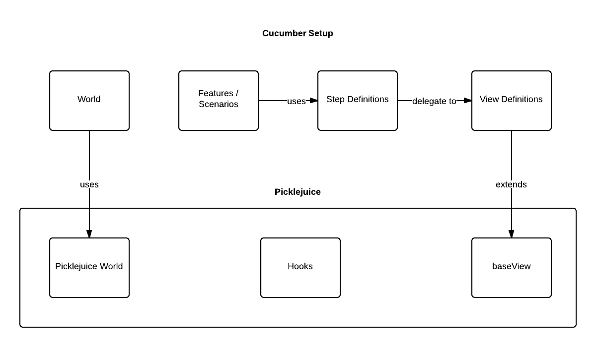

# Picklejuice
Functional Testing Framework based on Cucumber.js and WebdriverJS, written in CoffeeScript. Picklejuice is intended to run locally or on your CI and supports Saucelabs for running on multiple platforms.
Picklejuice is part of a larger ecosystem for end-to-end testing, in which Picklejuice provides the re-usable classes for the Cucumber.js infrastructure at Easytobook.com.

Picklejuice provides the following:

* picklejuice: mixin for your 'World' context object, required for all other picklejuice components
* hooks: generic before- and after hooks
* views: generic view definitions



### Initialization
In your World context, mixin the picklejuice object as follows:
```
World = (done, environment) ->

  [type, browser, version] = environment.split(':') if environment?.length

  type ?= 'local'
  browser ?= 'firefox'
  version ?= 'any'

  env = require("./env-#{type}")(browser)
  env.type = type
  pickledWorld.call this, env

  done() if done?
```

We use a modified version of cucumber which allow us to pass an environment object via the CLI so we can switch environments based on our grunt test targets. See https://github.com/easytobook/cucumber-js/commit/d6256155e9ad7657c64c6d5b2c2b5bb48aee85b8.
In the previous example we use an environment object, see [examples/env-local.coffee](examples/env-local.coffee) for an example.

When writing your view definitions, import the Picklejuice baseView:
```
BaseView = require 'picklejuice/lib/views/base'


class HomeView extends BaseView
   ...
```


#### Grunt integration
The grunt-picklejuice task allows you to specify which environment to use per grunt target. You can set up multiple grunt targets to support running the tests locally, on a CI server or on Saucelabs for example.

